# Literature Review

## Introduction

<!-- - Overview of the literature review -->

<!-- - Purpose and objectives of the review -->

## Research Questions

<!-- - List of research questions to be addressed -->

## Methodology

<!-- - Explanation of the research methodology used for the literature review -->

<!-- - Inclusion and exclusion criteria for selecting relevant literature -->

## Search Strategy

<!-- - Description of the search strategy used to identify relevant sources -->

<!-- - Databases and search terms used -->

## Literature Synthesis

<!-- - Summary and analysis of the key findings from the literature -->

<!-- - Identification of themes and patterns -->

## Critical Evaluation

<!-- - Evaluation of the quality and reliability of the literature -->

<!-- - Discussion of any limitations or biases in the literature -->

## Gaps and Future Directions

<!-- - Identification of gaps in the existing literature -->

<!-- - Suggestions for future research directions -->

## Conclusion

<!-- - Summary of the main findings from the literature review -->

<!-- - Implications for the research project -->

## References

| Authors    | Title                                                                                                                                    | Topics                                                                                                                                                 | Summary                                                                                                                                                                                                                                                                                                                                                                                                                                                                                   |
| :---------------- | ------------------------------------------------------------------------------------------------------------------------------------------ | -------------------------------------------------------------------------------------------------------------------------------------------------------- | ------------------------------------------------------------------------------------------------------------------------------------------------------------------------------------------------------------------------------------------------------------------------------------------------------------------------------------------------------------------------------------------------------------------------------------------------------------------------------------------- |
| C. Hu '24       | [Inference without Interference: Disaggregate LLM Inference for Mixed Downstream Workloads](https://arxiv.org/abs/2401.11181)            | LLMs, Inference, Inference Serving, Prompt, Transformer-based, Inference Request, Prefill Phase, Accelerators                                          | 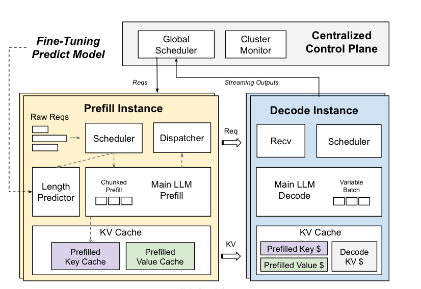[TetriInfer uses a smart two-level scheduling algorithm augmented with predicted resource usage to avoid decode scheduling hotspots and improves time-to-first-token (TTFT), job completion time (JCT), and inference efficiency in turns of performance per dollar by a large margin.](https://www.semanticscholar.org/paper/Inference-without-Interference%3A-Disaggregate-LLM-Hu-Huang/21e53e51ff77a5f34f43cb8ca029909c3ad9f71e)                                     |
| Hooper '24      | [KVQuant: Towards 10 Million Context Length LLM Inference with KV Cache Quantization](https://arxiv.org/abs/2401.18079)                  | Quantizaton, Context Window, WikiText-2, LLM Inference, Perplexity Degradation, Outliers, LLMs, LLAMA                                                  | 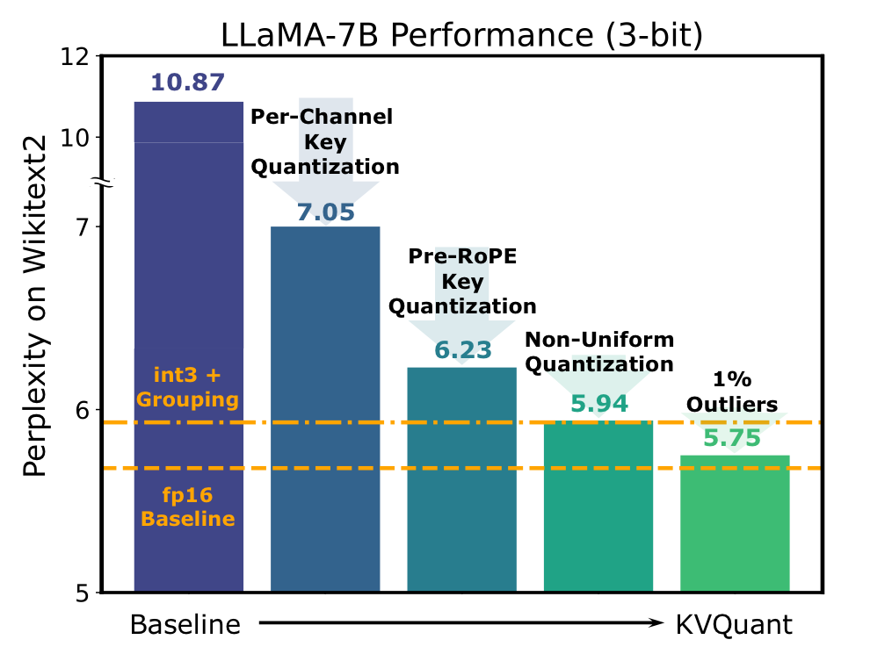[KVQuant is presented, which addresses the problem of quantizing cached KV cache activations by incorporating novel methods for quantizing cached KV activations.](https://www.semanticscholar.org/paper/KVQuant%3A-Towards-10-Million-Context-Length-LLM-with-Hooper-Kim/b085968c4362fb286ad6c5ef71a5db9630da0498)                                                                                            |
| Haris '24       | [Designing Efficient LLM Accelerators for Edge Devices](https://arxiv.org/abs/2408.00462)                                                |                                                                                                                                                        | 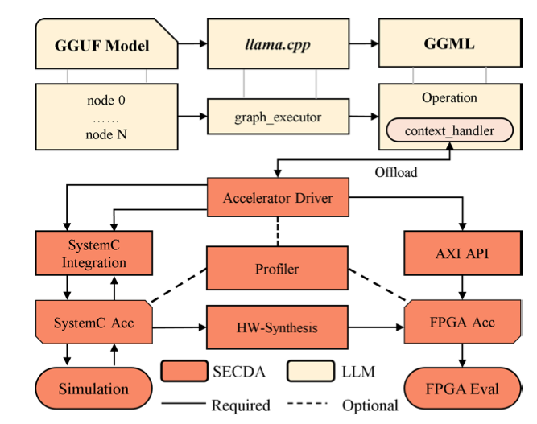[A new design platform is proposed, named SECDA-LLM, that utilizes the SECDA methodology to streamline the process of designing, integrating, and deploying efficient FPGA-based LLM accelerators for the llama.cpp inference framework and a new MatMul accelerator that supports block floating point quantized operations for LLMs.](https://www.semanticscholar.org/paper/Designing-Efficient-LLM-Accelerators-for-Edge-Haris-Saha/88ca3c288b057c8922a1eca02dfad545841ba6dc)          |
| Chen '23        | [Understanding the Potential of FPGA-Based Spatial Acceleration for Large Language Model Inference](https://arxiv.org/html/2312.15159v2) | Speedup, FPGA, GPT 2, Spatial Acceleration, BERT, HLS, LLMs, Open-sourcing, Generatiive Inference, Design For X                                        | 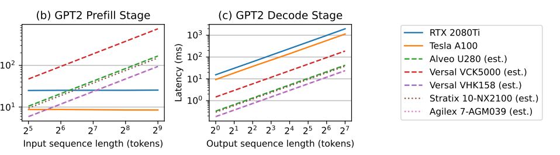[This paper introduces a comprehensive analytical model for estimating the performance of a spatial LLM accelerator, taking into account the on-chip compute and memory resources available on an FPGA, and provides a library of high-level synthesis kernels that are composable and reusable.](https://www.semanticscholar.org/paper/Understanding-the-Potential-of-FPGA-Based-Spatial-Chen-Zhang/47beae741f6a4470dbd286d4f3f05ba2031c52d2)                                            |
| X. Hu '24       | [I-LLM: Efficient Integer-Only Inference for Fully-Quantized Low-Bit Large Language Models](https://arxiv.org/abs/2405.17849)            |                                                                                                                                                        | 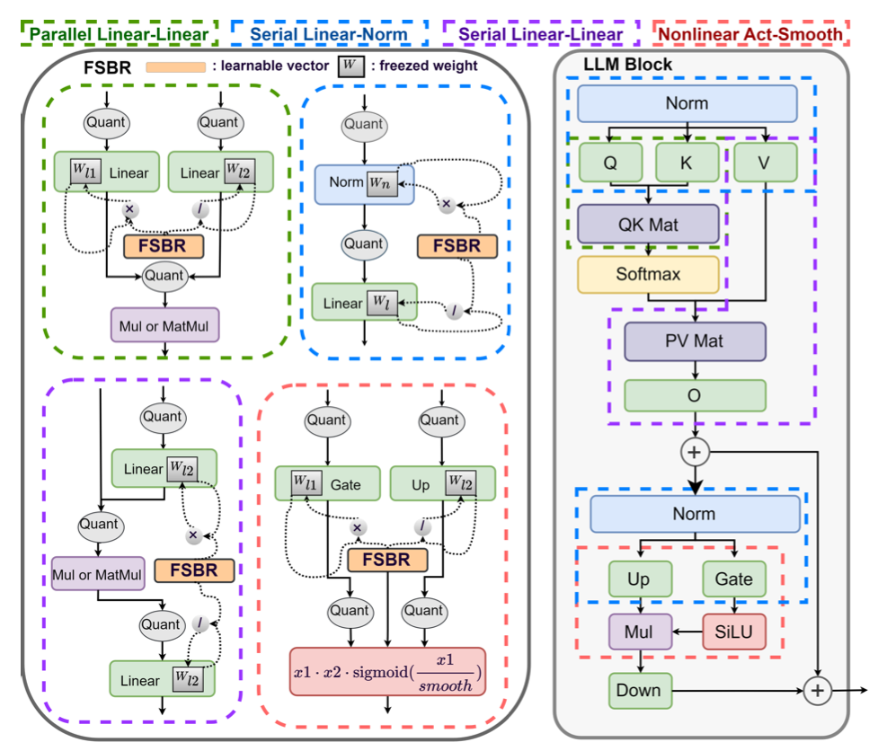[This work proposes I-LLM, a novel integer-only fully-quantized PTQ framework tailored for LLMs, and introduces a novel approach called Dynamic Integer-only MatMul (DI-MatMul), the first to bridge the gap between integer-only quantization and LLMs.](https://www.semanticscholar.org/paper/I-LLM%3A-Efficient-Integer-Only-Inference-for-Low-Bit-Hu-Cheng/f03bd1b959216fa22b3f72ef7f245e57ea7e45d7)                                                                                  |
| A. He '24         | [HLSTransform: Energy-Efficient Llama 2 Inference on FPGAs Via High Level Synthesis](https://arxiv.org/pdf/2405.00738)                   |                                                                                                                                                        | 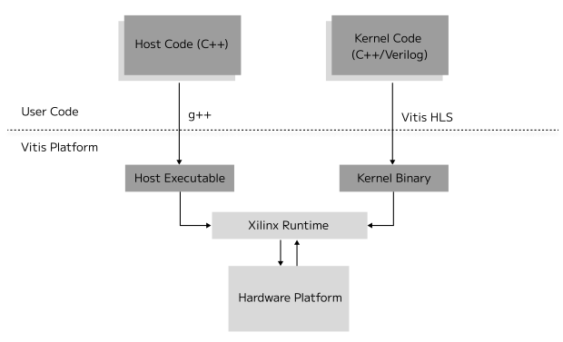[This work develops an accelerator for transformers, namely, Llama 2, an open-source state-of-the-art LLM, using high level synthesis (HLS) on Field Programmable Gate Arrays (FPGAs), and opens-sources the code and documents the steps for synthesis.](https://www.semanticscholar.org/paper/HLSTransform%3A-Energy-Efficient-Llama-2-Inference-on-He-Key/45c41eef002fee89fe01818dab17e0d839e78e64)                                                                                    |
| Dong '24        | [Get more with less: Synthesizing recurrence with KV cache compression for efficient llm inference](https://arxiv.org/pdf/2402.09398)    | Caching, KV Pairs, Eviction, LLM Inference, Decoding, KV Cache Compression, Pruning, Tokens, LLMs                                                      | 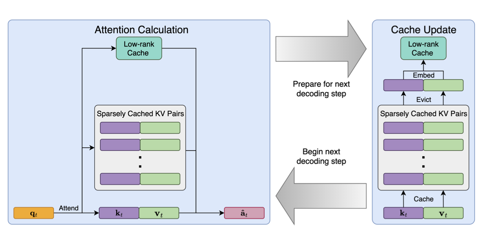[LESS, a simple integration of a (nearly free) constant sized cache with eviction-based cache methods, such that all tokens can be queried at later decoding steps, shows merit on a variety of tasks where it can help reduce the performance gap from caching everything.](https://www.semanticscholar.org/paper/Get-More-with-LESS%3A-Synthesizing-Recurrence-with-KV-Dong-Yang/ef1b02dc1b82f9955fc4760fcefd92c0fff9f227)                                                              |
| Li '20          | [FTRANS: energy-efficient acceleration of transformers using FPGA](https://arxiv.org/pdf/2007.08563)                                     | FPGA, NLP, Transformer, Computation, Model Compression, Block Circulant Matrix, Accuracy Degradation, Latency, Convolutions                            | 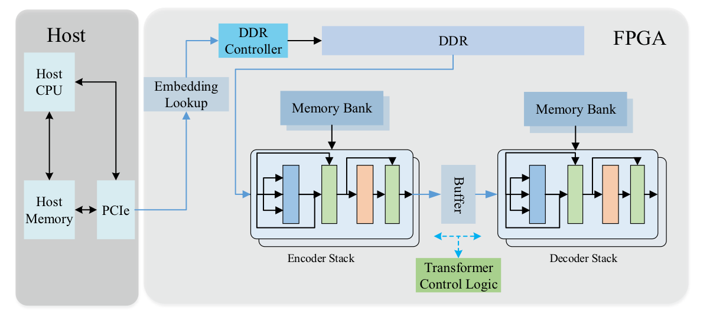[This paper proposes an efficient acceleration framework, Ftrans, for transformer-based large scale language representations, which includes enhanced block-circulant matrix (BCM)-based weight representation to enable model compression on large-scale language representations at the algorithm level with few accuracy degradation.](https://www.semanticscholar.org/paper/FTRANS%3A-energy-efficient-acceleration-of-using-FPGA-Li-Pandey/7c6c31412c5dad22543bb71e31620e8868d644a3) |
| Kachris '24     | [A Survey on Hardware Accelerators for Large Language Models](https://arxiv.org/pdf/2401.09890)                                          | LLMs, Harware Accelerators, NLP, FPGA                                                                                                                  | 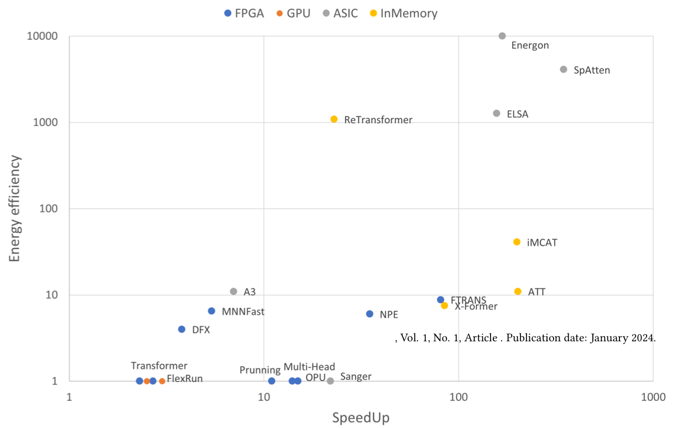[A comprehensive survey on hardware accelerators designed to enhance the performance and energy efficiency of Large Language Models is presented, exploring a diverse range of accelerators, including GPUs, FPGAs, and custom-designed architectures.](https://www.semanticscholar.org/paper/A-Survey-on-Hardware-Accelerators-for-Large-Models-Kachris/cf278f48c09c2747f415c0b190c09773673ea959)                                                                                        |
| Yuan '24        | [LLM Inference Unveiled: Survey and Roofline Model Insights](https://arxiv.org/pdf/2402.16363)                                           | LLMs, Inference, Roofline Model, Computation, Memory Bound, Open-sourcing, Quantization, Memory Accesses, Model Compression, Knowledge Distillation    | 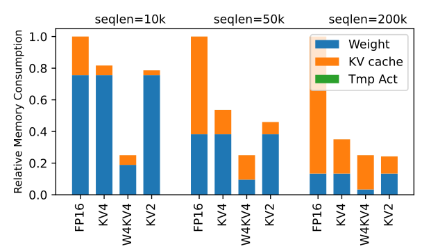[This survey systematically collates the latest advancements in efficient LLM inference, covering crucial areas such as model compression, algorithm improvements, and both hardware and system-level enhancements, and introduces a framework based on roofline model for systematic analysis of LLM inference techniques.](https://www.semanticscholar.org/paper/LLM-Inference-Unveiled%3A-Survey-and-Roofline-Model-Yuan-Shang/dbf829c977c121c3704d070d7800d29fe5914756)               |
| Zeng '24        | [FlightLLM: Efficient Large Language Model Inference with a Complete Mapping Flow on FPGAs](https://arxiv.org/pdf/2401.03868)            | LLMs Computation, FPGA, Memory-bandwidth, Sparsification, Quantization, Computational Efficiency, Compression Technique, Sparsity Pattern, SmoothQuant | 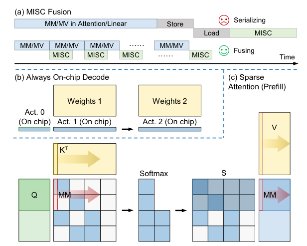[In FlightLLM, an innovative solution that the computation and memory overhead of LLMs can be solved by utilizing FPGA-specific resources (e.g., DSP48 and heterogeneous memory hierarchy) is highlighted, enabling efficient LLMs inference with a complete mapping flow on FPGAs.](https://www.semanticscholar.org/paper/FlightLLM%3A-Efficient-Large-Language-Model-Inference-Zeng-Liu/3695739b3a8b0e92b8ae90081124d098ae33b15c#citing-papers)                                         |
| J. He '24 | [FastDecode: High-Throughput GPU-Efficient LLM Serving using Heterogeneous Pipelines](https://arxiv.org/pdf/2403.11421)                  | LLMs, GPU, KV Cache, CPU, Sequence, Tokens, Transformer Model                                                                                          | 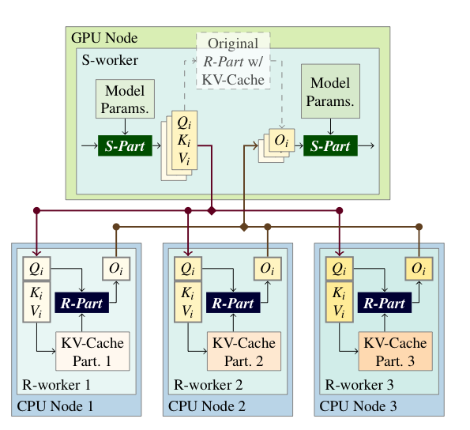[This work finds a way to decompose the transformer models into two parts of different characteristics, one of which includes the memory-bound KV-Cache accessing, and addresses efficiency challenges brought by heterogeneity at both temporal and inter-device scopes using scheduling and performance modeling techniques.](https://www.semanticscholar.org/paper/FastDecode%3A-High-Throughput-GPU-Efficient-LLM-using-He-Zhai/2be7acee3dfd9c4eb99755158d8c770ac2a36715)             |
| Zou '24  | [A Survey on Efficient Inference for Large Language Models](https://arxiv.org/pdf/2404.14294)                                            |                                                                                                                                                        | 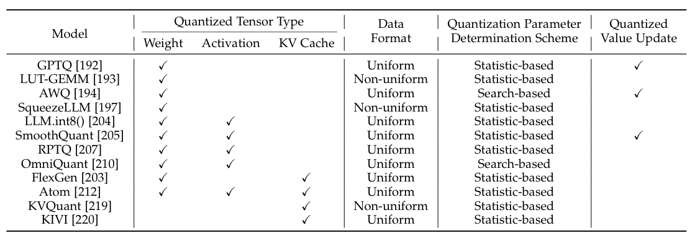[A comprehensive survey of the existing literature on efficient LLM inference is presented, analyzing the primary causes of the inefficient LLM inference and introducing a comprehensive taxonomy that organizes the current literature into data-level, model-level, and system-level optimization.](https://www.semanticscholar.org/paper/A-Survey-on-Efficient-Inference-for-Large-Language-Zhou-Ning/5be7e6b04c5a240cff340034aae2b57c677e211f)                                       |
