# Literature Review

## Introduction

<!-- - Overview of the literature review -->

<!-- - Purpose and objectives of the review -->

## Research Questions

<!-- - List of research questions to be addressed -->

## Methodology

<!-- - Explanation of the research methodology used for the literature review -->

<!-- - Inclusion and exclusion criteria for selecting relevant literature -->

## Search Strategy

<!-- - Description of the search strategy used to identify relevant sources -->

<!-- - Databases and search terms used -->

## Literature Synthesis

<!-- - Summary and analysis of the key findings from the literature -->

<!-- - Identification of themes and patterns -->

## Critical Evaluation

<!-- - Evaluation of the quality and reliability of the literature -->

<!-- - Discussion of any limitations or biases in the literature -->

## Gaps and Future Directions

<!-- - Identification of gaps in the existing literature -->

<!-- - Suggestions for future research directions -->

## Conclusion

<!-- - Summary of the main findings from the literature review -->

<!-- - Implications for the research project -->

## References

### Survey Papers
| Authors| Title | Summary |
| --- | --- | --- |
| Zou '24 | [A Survey on Efficient Inference for Large Language Models](https://arxiv.org/pdf/2404.14294) | 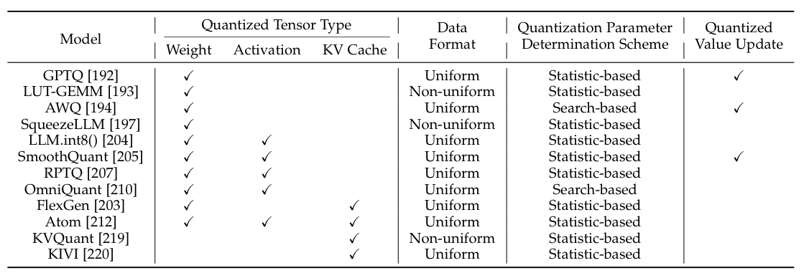[A comprehensive survey of the existing literature on efficient LLM inference is presented, analyzing the primary causes of the inefficient LLM inference and introducing a comprehensive taxonomy that organizes the current literature into data-level, model-level, and system-level optimization.](https://www.semanticscholar.org/paper/A-Survey-on-Efficient-Inference-for-Large-Language-Zhou-Ning/5be7e6b04c5a240cff340034aae2b57c677e211f) |
| Zhao '23 | [A Survey of Large Language Models](https://arxiv.org/pdf/2303.18223) | [A review of the recent advances of large language models by introducing the background, key findings, and mainstream techniques, and focusing on four major aspects of LLMs, namely pre-training, adaptation tuning, utilization, and capacity evaluation.](https://www.semanticscholar.org/paper/A-Survey-of-Large-Language-Models-Zhao-Zhou/c61d54644e9aedcfc756e5d6fe4cc8b78c87755d) |
| Kachris '24 | [A Survey on Hardware Accelerators for Large Language Models](https://arxiv.org/pdf/2401.09890) | 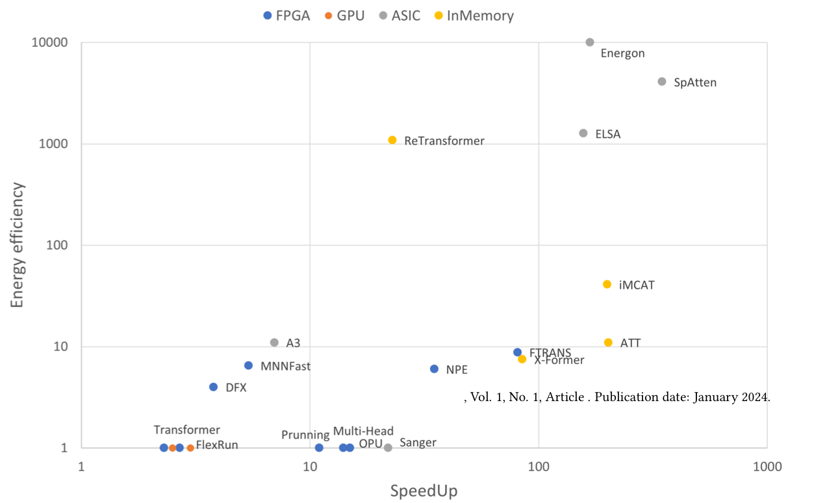[A comprehensive survey on hardware accelerators designed to enhance the performance and energy efficiency of Large Language Models is presented, exploring a diverse range of accelerators, including GPUs, FPGAs, and custom-designed architectures.](https://www.semanticscholar.org/paper/A-Survey-on-Hardware-Accelerators-for-Large-Models-Kachris/cf278f48c09c2747f415c0b190c09773673ea959)|
| Yuan '24 | [LLM Inference Unveiled: Survey and Roofline Model Insights](https://arxiv.org/pdf/2402.16363) | 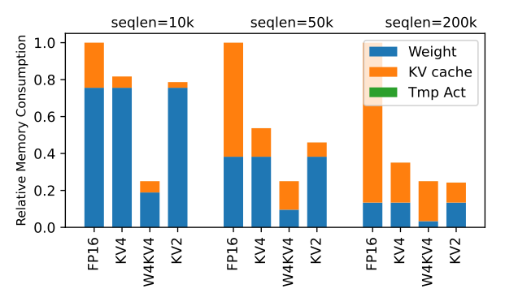[This survey systematically collates the latest advancements in efficient LLM inference, covering crucial areas such as model compression, algorithm improvements, and both hardware and system-level enhancements, and introduces a framework based on roofline model for systematic analysis of LLM inference techniques.](https://www.semanticscholar.org/paper/LLM-Inference-Unveiled%3A-Survey-and-Roofline-Model-Yuan-Shang/dbf829c977c121c3704d070d7800d29fe5914756)|
| Bobda '22 | [The Future of FPGA Acceleration in Datacenters and the Cloud](https://dl.acm.org/doi/10.1145/3506713) | 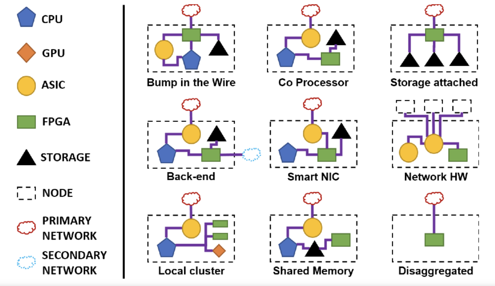[Current architectures and discusses scalability and abstractions supported by operating systems, middleware, and virtualization are explored and the viability of these architectures for popular applications is reviewed, with a particular focus on deep learning and scientific computing.](https://www.semanticscholar.org/paper/The-Future-of-FPGA-Acceleration-in-Datacenters-and-Bobda-Mbongue/47a0e5361cb0dd864afec0c5438cb52cf3add726) |
| Cong '22 | [FPGA HLS Today: Successes, Challenges, and Opportunities](https://doi.org/10.1145/3530775) | 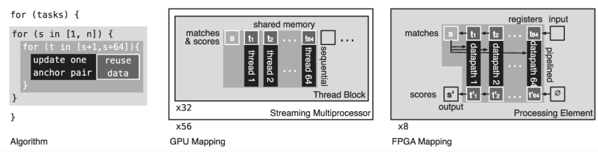[The progress of the deployment of HLS technology is assessed and the successes in several application domains are highlighted, including deep learning, video transcoding, graph processing, and genome sequencing.](https://www.semanticscholar.org/paper/FPGA-HLS-Today%3A-Successes%2C-Challenges%2C-and-Cong-Lau/34d861c3786c85f848da57e9679b26eaa14ed881) |
| W. Huang '24 | [An Empirical Study of LLaMA3 Quantization: From LLMs to MLLMs](https://arxiv.org/pdf/2404.14047.pdf) | 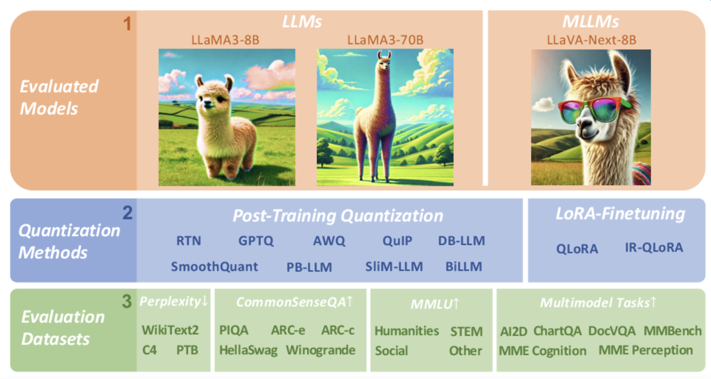[The experimental results indicate that LLaMA3 still suffers non-negligent degradation in linguistic and visual contexts, particularly under ultra-low bit widths, which highlights the significant performance gap under low bit-width that needs to be bridged in future developments.](https://www.semanticscholar.org/paper/An-Empirical-Study-of-LLaMA3-Quantization%3A-From-to-Huang-Ma/a41a372966c1d8dacf90fea9dd6f00564b430855) |
| Y. Huang '24 | [New Solutions on LLM Acceleration, Optimization, and Application](https://arxiv.org/pdf/2406.10903.pdf) | [This paper discusses algorithm-level acceleration techniques focused on optimizing LLM inference speed and resource utilization, and delves into LLM-to-accelerator compilation approaches, which involve customizing hardware accelerators for efficient LLM deployment.](https://www.semanticscholar.org/paper/New-Solutions-on-LLM-Acceleration%2C-Optimization%2C-Huang-Wan/236eeca00166bbfc0226c446e54e2189a0b500ae#citing-papers) |
| Luohe '24 | [Keep the Cost Down: A Review on Methods to Optimize LLM' s KV-Cache Consumption](https://arxiv.org/pdf/2407.18003) | 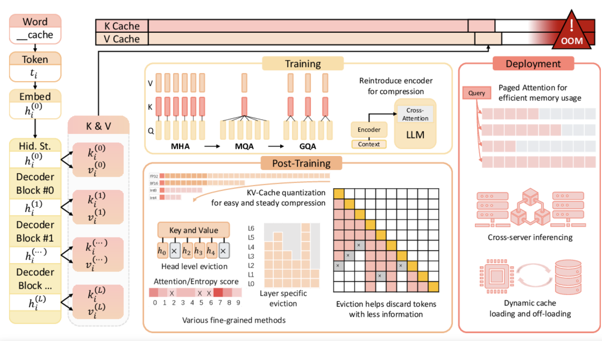[This review dissects the various properties of KV-Cache and elaborate on various methods currently used to optimize the KV-Cache space usage of LLMs, offering insights into future advancements in this dynamic field.](https://www.semanticscholar.org/paper/Keep-the-Cost-Down%3A-A-Review-on-Methods-to-Optimize-Luohe-Zhang/6c67e17fdd763f212e582f8de56b56dd5ed58832) |
| Cong '18 | [Understanding Performance Differences of FPGAs and GPUs](https://doi.org/10.1109/FCCM.2018.00023) | 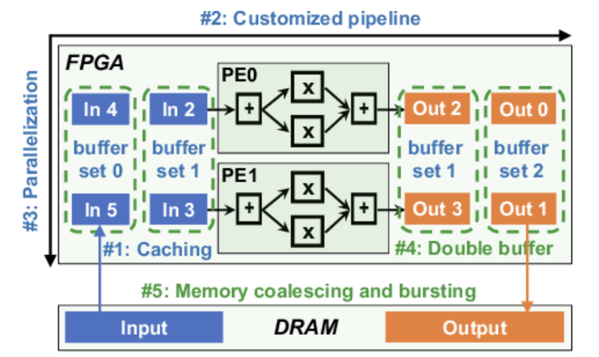[It is found that for 6 out of the 15 ported kernels, today's FPGAs can provide comparable performance or even achieve better performance than the GPU, while consuming an average of 28% of the GPU power.](https://www.semanticscholar.org/paper/Understanding-Performance-Differences-of-FPGAs-and-Cong-Fang/eaea200a1668724d47f1125ec9e96a7c03dad2ec) |

### KV Cache Optimization
| Authors | Title | Summary |
| --- | --- | --- |
| Hooper '24 | [KVQuant: Towards 10 Million Context Length LLM Inference with KV Cache Quantization](https://arxiv.org/abs/2401.18079) | 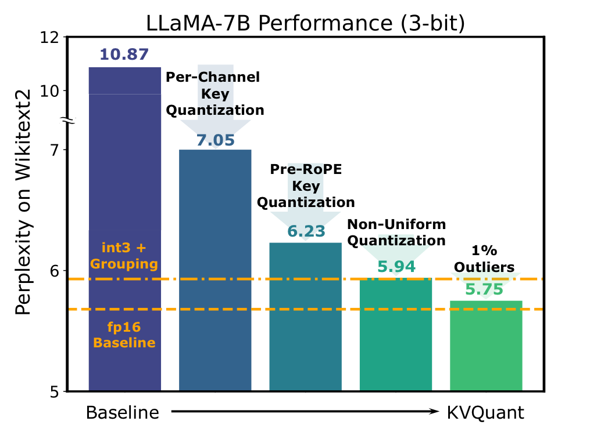[KVQuant is presented, which addresses the problem of quantizing cached KV cache activations by incorporating novel methods for quantizing cached KV activations.](https://www.semanticscholar.org/paper/KVQuant%3A-Towards-10-Million-Context-Length-LLM-with-Hooper-Kim/b085968c4362fb286ad6c5ef71a5db9630da0498) |
| Dong '24 | [Get more with less: Synthesizing recurrence with KV cache compression for efficient llm inference](https://arxiv.org/pdf/2402.09398) | 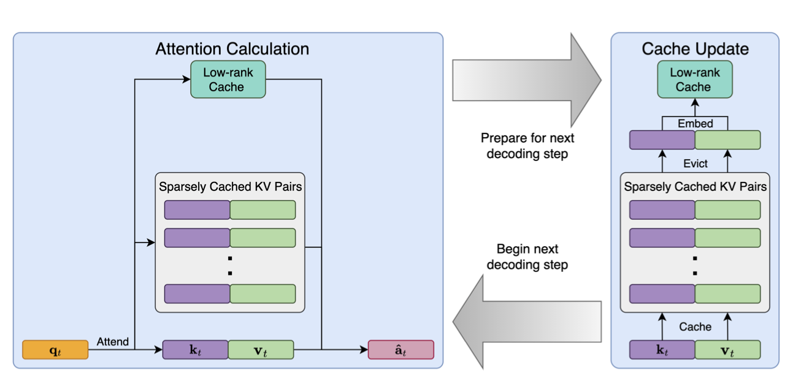[LESS, a simple integration of a (nearly free) constant sized cache with eviction-based cache methods, such that all tokens can be queried at later decoding steps, shows merit on a variety of tasks where it can help reduce the performance gap from caching everything.](https://www.semanticscholar.org/paper/Get-More-with-LESS%3A-Synthesizing-Recurrence-with-KV-Dong-Yang/ef1b02dc1b82f9955fc4760fcefd92c0fff9f227) |
| Yue '24 | [WKVQuant: Quantizing Weight and Key/Value Cache for Large Language Models Gains More](https://arxiv.org/pdf/2402.12065.pdf) | 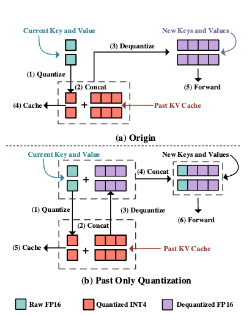 [This paper proposes WKVQuant, a PTQ framework especially designed for quantizing weights and the key/value (KV) cache of LLMs that incorporates past-only quantization to improve the computation of attention and introduces two-dimensional quantization strategy to handle the distribution of KV cache.](https://www.semanticscholar.org/paper/WKVQuant%3A-Quantizing-Weight-and-Key-Value-Cache-for-Yue-Yuan/f608011b0f50a14bb2949c186a7c632a099aa75b#paper-topics) |
| H. Zhang '24 | [PQCache: Product Quantization-based KVCache for Long Context LLM Inference](https://arxiv.org/pdf/2407.12820) | 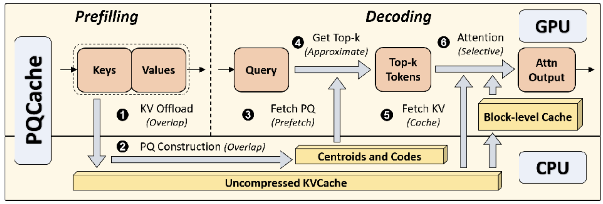[PQCache is proposed, which employs Product Quantization (PQ) to manage KVCache, maintaining model quality while ensuring low serving latency, and achieves both effectiveness and efficiency.](https://www.semanticscholar.org/paper/PQCache%3A-Product-Quantization-based-KVCache-for-LLM-Zhang-Ji/022f386eb66fc5532dd6f439e7a356fd33ebb9a2#related-papers) |

### Disaggregated LLM Inference
| Authors | Title | Summary |
| --- | --- | --- |
| C. Hu '24 | [Inference without Interference: Disaggregate LLM Inference for Mixed Downstream Workloads](https://arxiv.org/abs/2401.11181) | 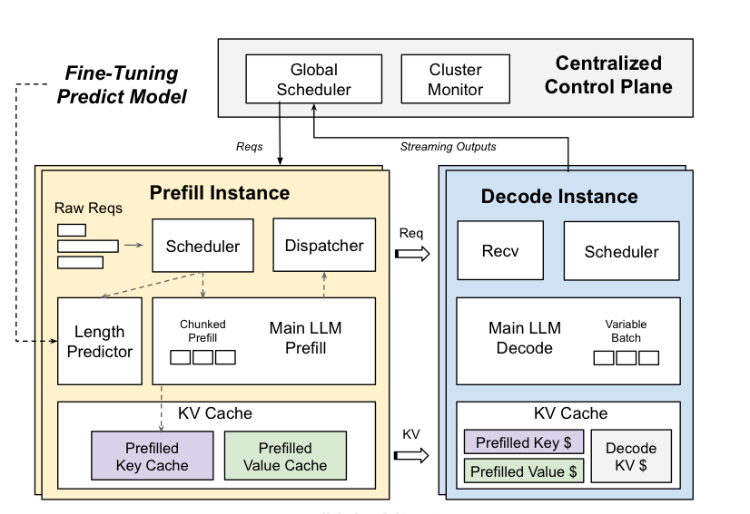[TetriInfer uses a smart two-level scheduling algorithm augmented with predicted resource usage to avoid decode scheduling hotspots and improves time-to-first-token (TTFT), job completion time (JCT), and inference efficiency in turns of performance per dollar by a large margin.](https://www.semanticscholar.org/paper/Inference-without-Interference%3A-Disaggregate-LLM-Hu-Huang/21e53e51ff77a5f34f43cb8ca029909c3ad9f71e) |
| Chen '23 | [Understanding the Potential of FPGA-Based Spatial Acceleration for Large Language Model Inference](https://arxiv.org/html/2312.15159v2) | 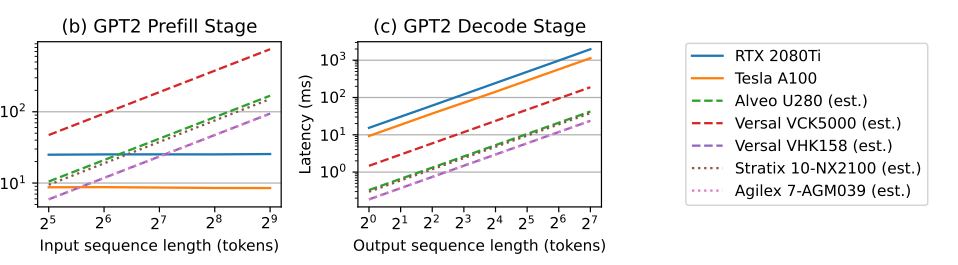[This paper introduces a comprehensive analytical model for estimating the performance of a spatial LLM accelerator, taking into account the on-chip compute and memory resources available on an FPGA, and provides a library of high-level synthesis kernels that are composable and reusable.](https://www.semanticscholar.org/paper/Understanding-the-Potential-of-FPGA-Based-Spatial-Chen-Zhang/47beae741f6a4470dbd286d4f3f05ba2031c52d2) |
| J. He '24 | [FastDecode: High-Throughput GPU-Efficient LLM Serving using Heterogeneous Pipelines](https://arxiv.org/pdf/2403.11421) | 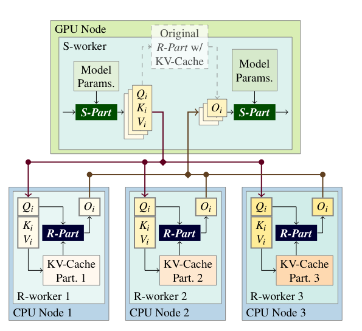[This work finds a way to decompose the transformer models into two parts of different characteristics, one of which includes the memory-bound KV-Cache accessing, and addresses efficiency challenges brought by heterogeneity at both temporal and inter-device scopes using scheduling and performance modeling techniques.](https://www.semanticscholar.org/paper/FastDecode%3A-High-Throughput-GPU-Efficient-LLM-using-He-Zhai/2be7acee3dfd9c4eb99755158d8c770ac2a36715) |
| Zhong '24 | [DistServe: Disaggregating Prefill and Decoding for Goodput-optimized Large Language Model Serving](https://arxiv.org/pdf/2401.09670.pdf) | 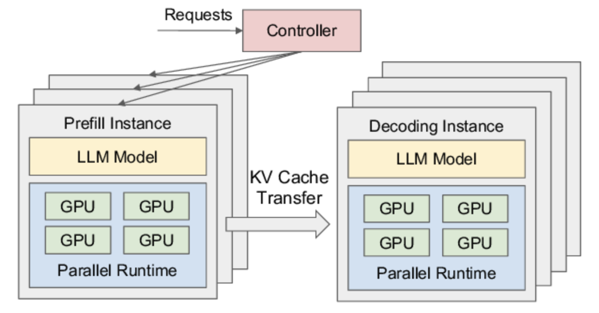[DistServe significantly improves LLM serving performance in terms of the maximum rate that can be served within both TTFT and TPOT constraints on each GPU, and assigns prefill and decoding computation to different GPUs, hence eliminating prefill-decoding interferences.](https://www.semanticscholar.org/paper/DistServe%3A-Disaggregating-Prefill-and-Decoding-for-Zhong-Liu/72f77a393079431e4207b3afe678ee80b420e6f8) |

| Authors | Title | Summary |
| --- | --- | --- |
| Haris '24 | [Designing Efficient LLM Accelerators for Edge Devices](https://arxiv.org/abs/2408.00462) | 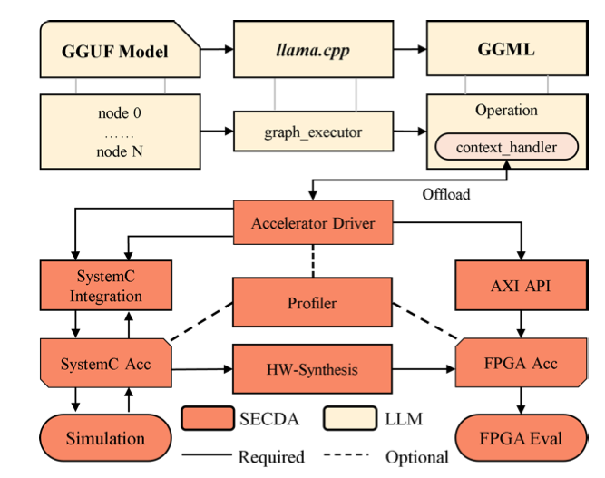[A new design platform is proposed, named SECDA-LLM, that utilizes the SECDA methodology to streamline the process of designing, integrating, and deploying efficient FPGA-based LLM accelerators for the llama.cpp inference framework and a new MatMul accelerator that supports block floating point quantized operations for LLMs.](https://www.semanticscholar.org/paper/Designing-Efficient-LLM-Accelerators-for-Edge-Haris-Saha/88ca3c288b057c8922a1eca02dfad545841ba6dc) |
| X. Hu '24 | [I-LLM: Efficient Integer-Only Inference for Fully-Quantized Low-Bit Large Language Models](https://arxiv.org/abs/2405.17849) | 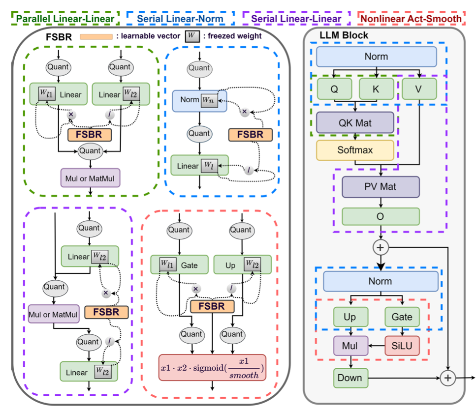[This work proposes I-LLM, a novel integer-only fully-quantized PTQ framework tailored for LLMs, and introduces a novel approach called Dynamic Integer-only MatMul (DI-MatMul), the first to bridge the gap between integer-only quantization and LLMs.](https://www.semanticscholar.org/paper/I-LLM%3A-Efficient-Integer-Only-Inference-for-Low-Bit-Hu-Cheng/f03bd1b959216fa22b3f72ef7f245e57ea7e45d7) |
| A. He '24 | [HLSTransform: Energy-Efficient Llama 2 Inference on FPGAs Via High Level Synthesis](https://arxiv.org/pdf/2405.00738) | 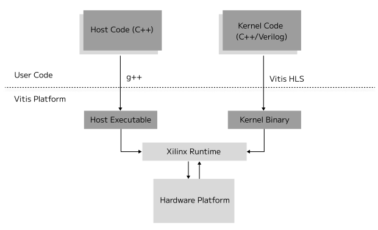[This work develops an accelerator for transformers, namely, Llama 2, an open-source state-of-the-art LLM, using high level synthesis (HLS) on Field Programmable Gate Arrays (FPGAs), and opens-sources the code and documents the steps for synthesis.](https://www.semanticscholar.org/paper/HLSTransform%3A-Energy-Efficient-Llama-2-Inference-on-He-Key/45c41eef002fee89fe01818dab17e0d839e78e64) |
| Li '20 | [FTRANS: energy-efficient acceleration of transformers using FPGA](https://arxiv.org/pdf/2007.08563) | 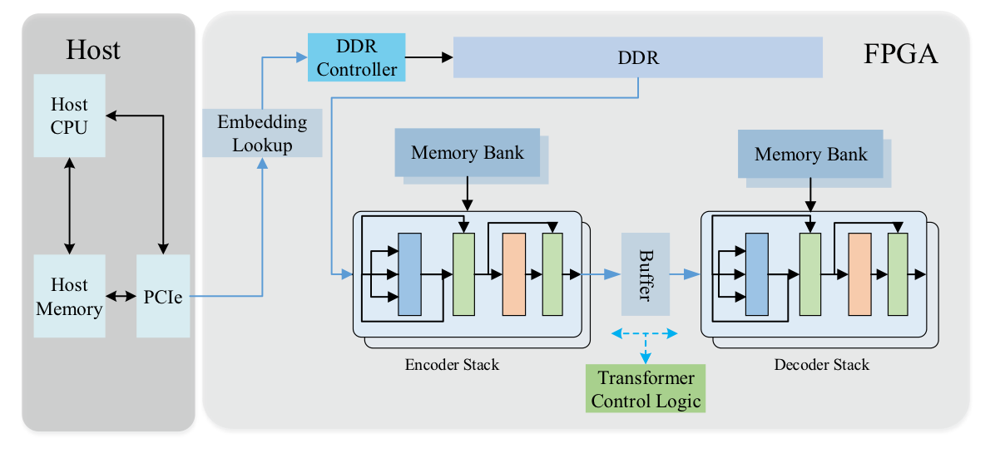[This paper proposes an efficient acceleration framework, Ftrans, for transformer-based large scale language representations, which includes enhanced block-circulant matrix (BCM)-based weight representation to enable model compression on large-scale language representations at the algorithm level with few accuracy degradation.](https://www.semanticscholar.org/paper/FTRANS%3A-energy-efficient-acceleration-of-using-FPGA-Li-Pandey/7c6c31412c5dad22543bb71e31620e8868d644a3) |
| Zeng '24 | [FlightLLM: Efficient Large Language Model Inference with a Complete Mapping Flow on FPGAs](https://arxiv.org/pdf/2401.03868) | 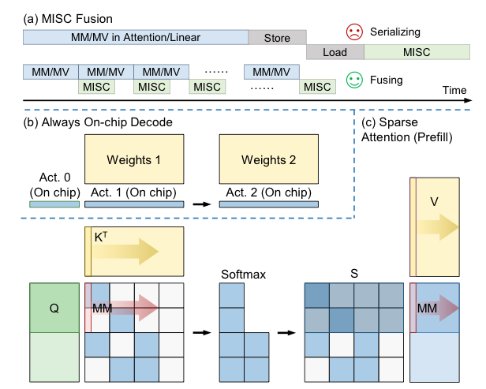[In FlightLLM, an innovative solution that the computation and memory overhead of LLMs can be solved by utilizing FPGA-specific resources (e.g., DSP48 and heterogeneous memory hierarchy) is highlighted, enabling efficient LLMs inference with a complete mapping flow on FPGAs.](https://www.semanticscholar.org/paper/FlightLLM%3A-Efficient-Large-Language-Model-Inference-Zeng-Liu/3695739b3a8b0e92b8ae90081124d098ae33b15c#citing-papers) |
| Hong '22 | [DFX: A Low-latency Multi-FPGA Appliance for Accelerating Transformer-based Text Generation](https://arxiv.org/pdf/2209.10797) | 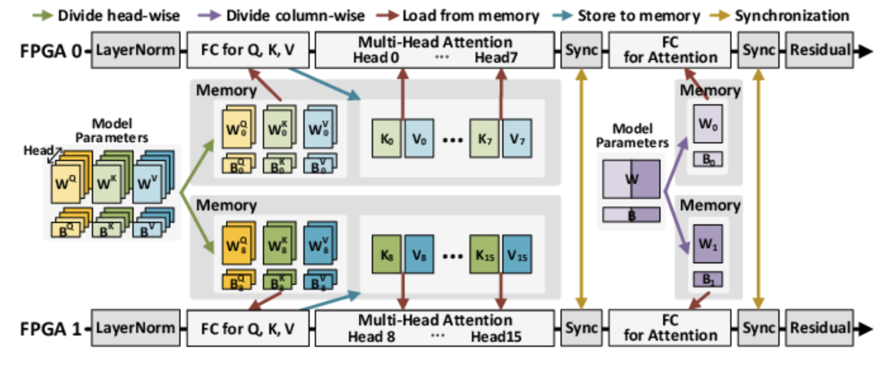[DFX is presented, a multi-FPGA acceleration appliance that executes GPT-2 model inference end-to-end with low latency and high throughput in both summarization and generation stages, suggesting that it is a promising solution for text generation workloads in cloud datacenters.](https://www.semanticscholar.org/paper/DFX%3A-A-Low-latency-Multi-FPGA-Appliance-for-Text-Hong-Moon/86891d00499eebe86d3f1e39143d412addf2652b#paper-topics) |
| Gao '24 | [The Feasibility of Implementing Large-Scale Transformers on Multi-FPGA Platforms](https://arxiv.org/pdf/2404.16158.pdf) | 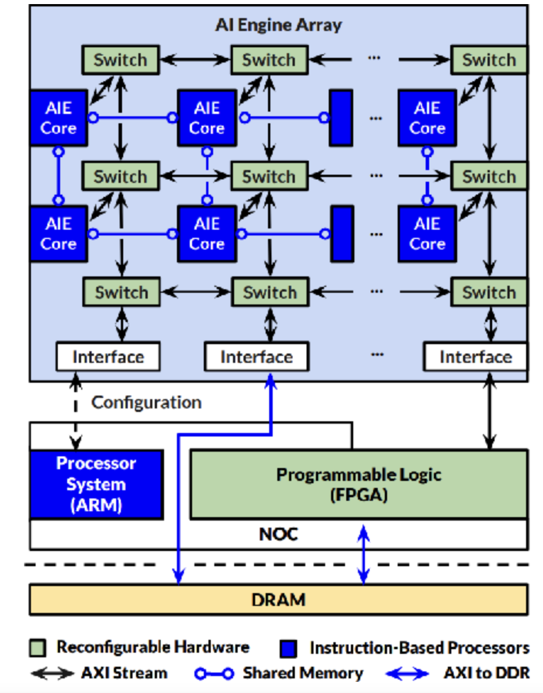[There can be a place for FPGAs in the world of large machine learning applications by developing a scalable multi-FPGA platform and some tools to map large applications to the platform.](https://www.semanticscholar.org/paper/The-Feasibility-of-Implementing-Large-Scale-on-Gao-Vega/17a8d1eabb0c9d2e3ec5406797c1960f4e569909) |
| Chen '24 | [Allo: A Programming Model for Composable Accelerator Design](https://arxiv.org/pdf/2404.04815.pdf) | 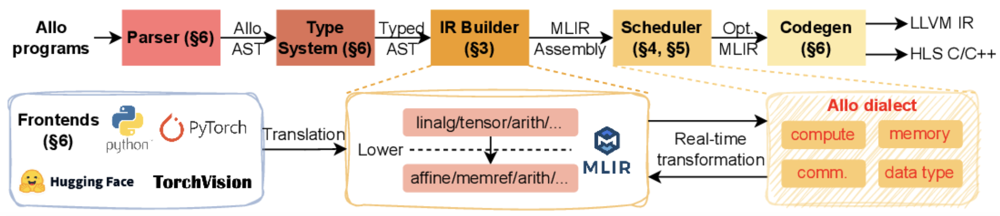[Allo is introduced, a composable programming model for efficient spatial accelerator design that decouples hardware customizations, including compute, memory, communication, and data type from algorithm specification, and encapsulates them as a set of customization primitives, which facilitates holistic optimizations that span across function boundaries.](https://www.semanticscholar.org/paper/Allo%3A-A-Programming-Model-for-Composable-Design-Chen-Zhang/dbb89e29f18cbf011cc31d748503a3070cf1d544) |
| P. Zhang '24 | [TinyLlama: An Open-Source Small Language Model](https://arxiv.org/pdf/2401.02385.pdf) | 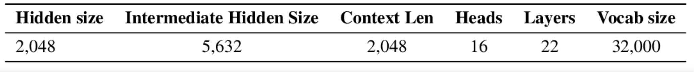[TinyLlama is presented, a compact 1.1B language model pretrained on around 1 trillion tokens for approximately 3 epochs that significantly outperforms existing open-source language models with comparable sizes.](https://www.semanticscholar.org/paper/TinyLlama%3A-An-Open-Source-Small-Language-Model-Zhang-Zeng/560c6f24c335c2dd27be0cfa50dbdbb50a9e4bfd) |
| Jiang '21 | [FleetRec: Large-Scale Recommendation Inference on Hybrid GPU-FPGA Clusters](https://dl.acm.org/doi/10.1145/3447548.3467139) | 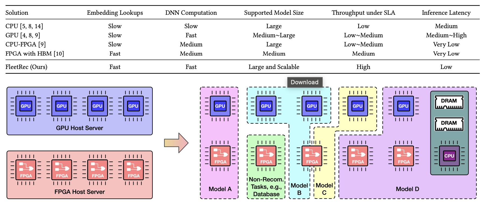[Experiments on three production models show that FleetRec outperforms optimized CPU baseline by more than one order of magnitude in terms of throughput while achieving significantly lower latency.](https://www.semanticscholar.org/paper/FleetRec%3A-Large-Scale-Recommendation-Inference-on-Jiang-He/4db7ab28050b38bcacdb4736f987cd5b23a65a67) |
| Jiang '23 | [Chameleon: a Heterogeneous and Disaggregated Accelerator System for Retrieval-Augmented Language Models](https://arxiv.org/pdf/2310.09949.pdf) | 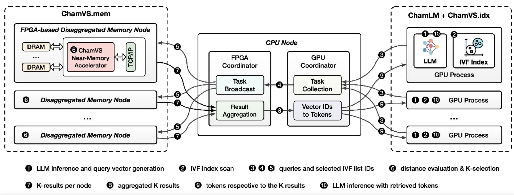[This work proposes Chameleon, a heterogeneous accelerator system that integrates both LM and retrieval accelerators in a disaggregated architecture, and demonstrates promising results, paving the way for bringing accelerator heterogeneity and disaggregation into future RALM systems.](https://www.semanticscholar.org/paper/Chameleon%3A-a-Heterogeneous-and-Disaggregated-System-Jiang-Zeller/f163042aadc800489516f86475165543a62c88b1#citing-papers) |